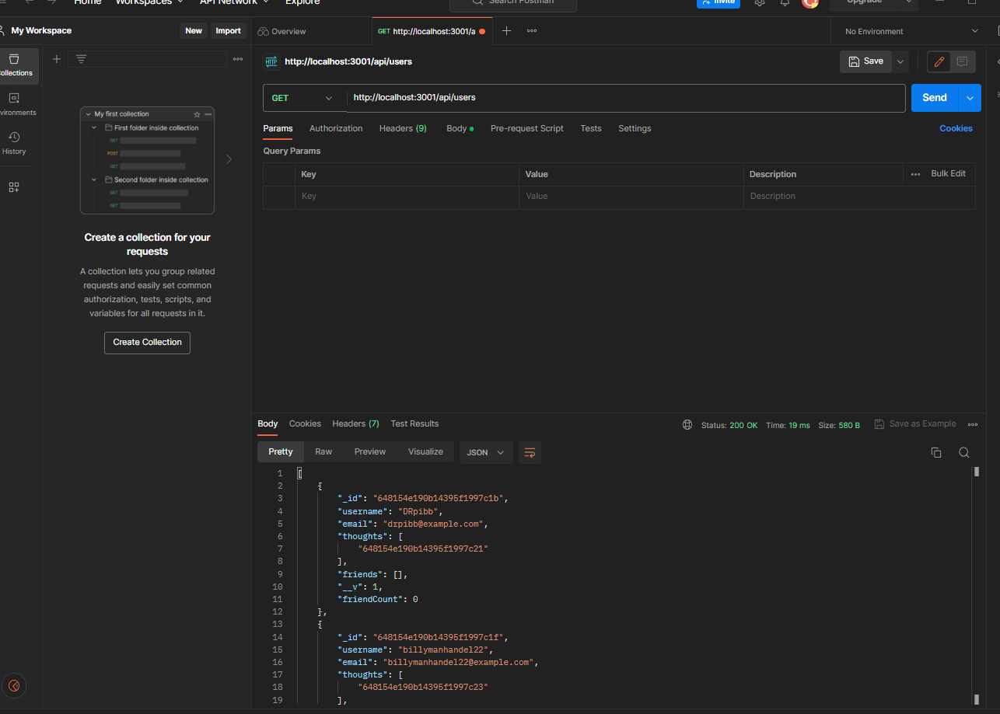

# MongosBongo

</a>
 

## Description

an api using mongodb to get, post, delete and put routes.

## Table of Contents

- [Installation](#installation)
- [Usage](#usage)
- [Questions](#Questions)

## Installation

run npm install and set up mongodb database, then run the file.

## Usage

  use postman or imsomnia to get, post, put, or delete information.

## Questions

JoseTorres26
https://github.com/JoseTorres26

## Tests
